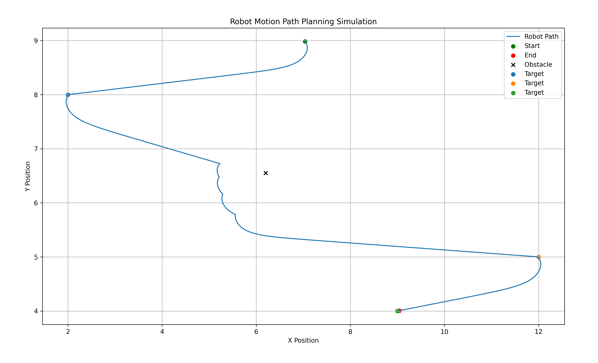

# 🤖 Autonomous Robot Motion Planning Simulator

## 🚀 Overview
This project simulates an autonomous robot navigating through multiple target points while avoiding obstacles using vector-based motion planning.

## 🧠 Features
- Multi-target navigation
- Obstacle avoidance system
- Angle-based steering control
- Path visualization using Matplotlib

## ⚙️ Technologies
- Python
- NumPy
- Matplotlib

## ▶️ How to Run
```bash
pip install numpy matplotlib
python main.py

## 📷 Simulation Output
